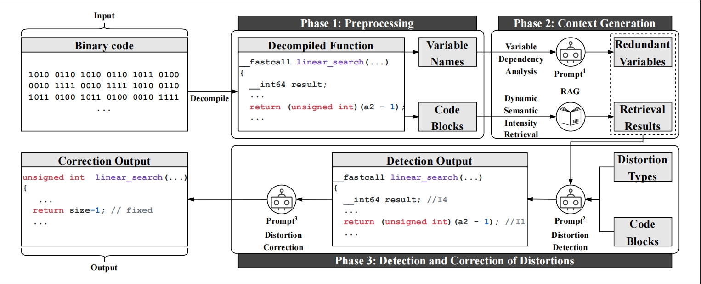

<div align=center></div>

## FidelityGPT: Correcting Decompilation Distortions with Retrieval Augmented Generation.
## Source Code Structure
The following is a brief introduction to the directory structure of this artifact:
```
- sourcecode/          ; main source code directory
    - Evaluation/      ; folder for evaluation-related scripts and data
        - Evaluation.py          ; main evaluation script
        - Evaluation-.py          ; additional evaluation script
        - ground_truth.txt       ; ground truth data for evaluation
        - model_output.txt       ; model output for comparison
    - output/           ; folder for outputs
        - test_RAG_answer.txt    ; test results from RAG evaluation
    - testdata/         ; test data and supporting files
        - test.txt                ; test data file
- FidelityGPT.py          ; main FidelityGPT script
- document_processor.py   ; document processing utility
- dynamic_semantic_intensity.py      ; Dynamic Semantic Intensity algorithm
- embedding_retriever.py  ; script for retrieving embeddings
- fidelity_new.c          ; RAG distortion database
- prompt_templates.py     ; prompt templates for testing       
- variabledependency.py   ;Variable Dependency Algorithm
- correction.py   ; Decompilation code correction

```
## Dataset
```
- dataset/          ; folder for datasets
    - Experiment Result.xlsx      ; stores results related to detection and correction
    - Ground Truth.xlsx      ; contains part of the dataset for comparison
```
## How to run
```
1. Place the decompiled functions to be processed in the testdata folder, with different functions separated by ‘/////’.
2. Run FidelityGPT.py, and the output will be saved in the output folder.
3. Copy the output results from the output folder to Evaluation/model_output.txt, and run Evaluation/Evaluation.py.
4. Copy the output results from the output folder to the testdata folder, and run correction.py
```
